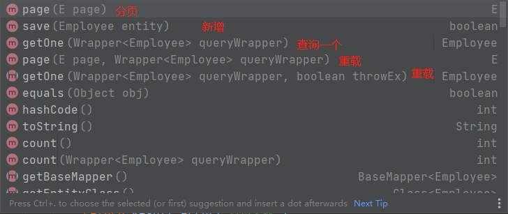

## 常用模板...

---

#### mysql 8.x driver、url

```properties
driver=com.mysql.cj.jdbc.Driver
url=jdbc:mysql://localhost:3306/myabties?useSSL=true&useUnicode=true&characterEncoding=utf-8&serverTimezone=UTC
username=root
password=123456
```

注：

- url 的 serveTimezone 是时区，8.x 之前不需要指定，8.x 之后不指定时间会有问题
- 8.x 的 driver 和 5.x 的也不同，5.x 是

```properties
driver=com.mysql.jdbc.Driver
```

---

#### MybatisUtils.java

```java
package com.lixingyu.utils;

import org.apache.ibatis.io.Resources;
import org.apache.ibatis.session.SqlSession;
import org.apache.ibatis.session.SqlSessionFactory;
import org.apache.ibatis.session.SqlSessionFactoryBuilder;

import java.io.IOException;
import java.io.InputStream;

public class MybatisUtil {

    private static SqlSessionFactory sqlSessionFactory;

    static {
        try {
            String resource = "mybatis-config.xml";
            InputStream inputStream = Resources.getResourceAsStream(resource);
            sqlSessionFactory = new SqlSessionFactoryBuilder().build(inputStream);
        } catch (IOException e) {
            e.printStackTrace();
        }
    }


    // openSession(true) 设置事务自动提交 默认不提交则参数为空即可
    public static SqlSession getSqlSession() {
        return sqlSessionFactory.openSession(true);
    }
}
```

#### myBatis-config.xml 模板

```xml
<?xml version="1.0" encoding="UTF-8" ?>
<!DOCTYPE configuration
        PUBLIC "-//mybatis.org//DTD Config 3.0//EN"
        "http://mybatis.org/dtd/mybatis-3-config.dtd">
<!--核心配置文件-->
<configuration>

    <!-- 外部引入properties -->
    <properties resource="db.properties"/>

    <settings>
        <!-- 标准日志 -->
        <setting name="logImpl" value="STDOUT_LOGGING"/>
<!--        <setting name="logImpl" value="LOG4J"/>-->
    </settings>

    <!-- 指定缩略名字，代替全限定名 -->
    <typeAliases>
        <package name="com.lixingyu.pojo"/>
    </typeAliases>

    <!-- 环境 -->
    <environments default="development">
        <environment id="development">
            <transactionManager type="JDBC"/>
            <dataSource type="POOLED">
                <property name="driver" value="${driver}"/>
                <property name="url" value="${url}"/>
                <property name="username" value="${username}"/>
                <property name="password" value="${password}"/>
            </dataSource>
        </environment>
    </environments>

    <!-- 映射的mapper -->
    <mappers>
        <mapper resource="com.lixingyu.mapper/TeacherMapper.xml"/>
        <mapper resource="com.lixingyu.mapper/StudentMapper.xml"/>
    </mappers>
</configuration>
```

---

#### maven 打包问题

maven 默认不会打包 main/src 下的.xml 和.properties，需要手动配置

    在pom.xml中加入

```xml
<!--maven默认不会build java文件夹下的xml和.properties文件，需要手动设置-->
<build>
    <resources>
        <resource>
            <!--java目录配置-->
            <directory>src/main/java</directory>
            <includes>
                <include>**/*.xml</include>
                <include>**/*.properties</include>
            </includes>
            <filtering>true</filtering>
        </resource>

        <!--resources目录配置-->
        <resource>
            <directory>src/main/resources</directory>
            <includes>
                <include>**/*.xml</include>
                <include>**/*.properties</include>
            </includes>
            <filtering>true</filtering>
        </resource>
    </resources>
</build>
```

---

#### xxxMapper.xml 模板

```xml
<?xml version="1.0" encoding="UTF-8" ?>
<!DOCTYPE mapper
        PUBLIC "-//mybatis.org//DTD Mapper 3.0//EN"
        "http://mybatis.org/dtd/mybatis-3-mapper.dtd">

<!-- namespace绑定对应mapper接口 -->
<mapper namespace="com.lixingyu.mapper.TeacherMapper">

    <!-- example: -->
    <select id="getTeacher">
        select * from teacher where id = ##{id};
    </select>

</mapper>
```

---

## 结果集 一对多 和 多对一

#### association   多对一

```xml
<resultMap id="TeacherStudent" type="Teacher">
	<association property="" column="" javaType=""></association>
</resultMap>
```

#### collection     一对多

```xml
<resultMap id="TeacherStudent" type="Teacher">
	<collection property="" column="" ofType=""></collection>
</resultMap>
```

**javaType**   association 或 collection 中的对应某个实体类中字段的类型

**ofType**   collection 中用于指定集合里的每一项的类型

---

## 动态 SQL

    	作用：动态 SQL 是 MyBatis 的强大特性之一。如果你使用过 JDBC 或其它类似的框架，你应该能理解根据不同条件拼接 SQL 语句有多痛苦，例如拼接时要确保不能忘记添加必要的空格，还要注意去掉列表最后一个列名的逗号。利用动态 SQL，可以彻底摆脱这种痛苦。

---

#### 通过标签在 xml 配置中实现 sql 的动态拼接

######## if

if 标签里必填**test**属性，代表 if 条件

mapper 接口：

```java
package com.lixingyu.mapper;

import com.lixingyu.pojo.Blog;

import java.util.List;
import java.util.Map;

public interface BlogMapper {

//    int addBlog(Blog blog);
//
//    List<Blog> getBlogs();

    // 查询博客
    List<Blog> queryIF(Map map);
}
```

mapper.xml

```xml
<select id="queryIF" parameterType="map" resultType="blog">
    select * from Blog where 1=1
    <if test="title != null">
        and title = ##{title}
    </if>
    <if test="author != null">
        and author = ##{author};
    </if>
</select>
```

test 测试

```java
@Test
public void testFindIF() {
    SqlSession sqlSession = MybatisUtil.getSqlSession();
    BlogMapper mapper = sqlSession.getMapper(BlogMapper.class);
    HashMap<String, String> map = new HashMap<String, String>();
    map.put("author", "lxy");
    map.put("title","vue");
    // 根据map里的key-value查询，有author就查author,有title就查title,都没有就查所有
    List<Blog> blogList = mapper.queryIF(map);
    for (Blog blog : blogList) {
        System.out.println(blog);
    }
    sqlSession.close();
}
```

---

######## where

在拼接 sql 时，单纯用 if 标签会有多个 and 的问题，就不得不加个 1=1 的条件，用 where 标签可以解决这个问题

- where 元素只会在**至少有一个子元素的条件返回 SQL 子句**的情况下才去插入 where 子句。
- 若语句的开头为“AND”或“OR",where 元素也会将它们去除。

```xml
<select id="queryIF" parameterType="map" resultType="blog">
    select * from Blog
    <where>
        <if test="title != null">
            title = ##{title}
        </if>
        <if test="author != null">
            and author = ##{author};
        </if>
    </where>
</select>
```

---

######## choose-when-otherwise

```xml
<select id="queryChoose" parameterType="map" resultType="blog">
    select * from Blog
    <where>
        <choose>
            <when test="title != null">
                title = ##{title}
            </when>
            <when test="author != null">
                and author = ##{author}
            </when>
            <otherwise>
                and views = ##{views}
            </otherwise>
        </choose>
    </where>
</select>
```

**choose-when-otherwise  ==  switch-case-default**，when 里的条件成立，走第一个成立的条件，都不成立走 otherwise

---

######## set

```xml
<update id="updateBlog" parameterType="map">
    update Blog
    <set>
        <if test="title != null">
            title = ##{title},
        </if>
        <if test="author != null">
            author = ##{author},
        </if>
    </set>
    where id = ##{id}
</update>
```

更新操作时，加上 set 标签，当子句符合条件，会自动补充**set**关键词，使 sql 成立，也会自动去掉最后一个子句的逗号。

######## trim \*

可以指定 where,set 等句子的格式

如果 _where_ 元素与你期望的不太一样，你也可以通过自定义 trim 元素来定制 _where_ 元素的功能。比如，和 _where_ 元素等价的自定义 trim 元素为

```xml
<trim prefix="WHERE" prefixOverrides="AND |OR ">
  ...
</trim>
```

```xml
<trim prefix="SET" suffixOverrides=",">
  ...
</trim>
```

- prefix 前缀
- prefixOverrides 前缀重写
- suffixOverrides   后缀重写

---

######## foreach

foreach 可以动态的拼接一些 sql,例如：

mapper 接口：

```java
// foreach查询
    List<Blog> queryForEach(Map map);
```

xml 配置

```xml
<select id="queryForEach" parameterType="map" resultType="blog">
    select * from Blog
    <where>
        <foreach collection="ids" item="id" open="and (" separator="or" close=")">
            id = ##{id}
        </foreach>
    </where>
</select>
```

- collection 可迭代对象
- items   迭代对象每一项的别名
- open   迭代开始时，在开始添加什么
- separator   中间用什么分割
- close   迭代结尾，在结尾添加什么

test 测试

```java
@Test
public void testQueryForEach() {
    SqlSession sqlSession = MybatisUtil.getSqlSession();
    BlogMapper mapper = sqlSession.getMapper(BlogMapper.class);
    Map map = new HashMap<>();
    ArrayList<Integer> ids = new ArrayList<>();
    ids.add(1);
    ids.add(2);
    ids.add(3);
    map.put("ids",ids);
    List<Blog> blogs = mapper.queryForEach(map);
    for (Blog blog : blogs) {
        System.out.println(blog);
    }
}
```

    	我们接口的参数是一个map,假如我们在map中传入一个可迭代的List,命名为ids,传入foreach可迭代对象，根据上面代码，动态拼接出的sql为：

```sql
select * from Blog WHERE ( id = ? or id = ? or id = ? )
				==> Parameters: 1(Integer), 2(Integer), 3(Integer)
```

---

#### sql 片段

提取公共 sql 片段

```xml
<sql id="if-title-author">
    <if test="title != null">
        title = ##{title}
    </if>
    <if test="author != null">
        and author = ##{author};
    </if>
</sql>
```

使用时

```xml
<include refid="if-title-author" />
```

---

## mybatis 缓存

#### 一级缓存

一级缓存也叫本地缓存：SqlSession

- 与数据库同一次会话期间查询到的数据会放在本地缓存中。
- 以后如果需要获取相同的数据，直接从缓存中拿，没必须再去查询数据库；

测试：

1.  开启日志
2.  测试一个在一个 sqlsession 中查询两次同一个用户

- xml

```xml
<?xml version="1.0" encoding="UTF-8" ?>
<!DOCTYPE mapper
        PUBLIC "-//mybatis.org//DTD Config 3.0//EN"
        "http://mybatis.org/dtd/mybatis-3-mapper.dtd">

<mapper namespace="com.lixingyu.dao.UserMapper">
    <select id="queryUserById" resultType="user">
        select * from user where id = ##{id};
    </select>
</mapper>
```

- test

```java
@Test
public void testQueryUserById() {
    SqlSession sqlSession = MybatisUtil.getSqlSession();
    UserMapper mapper = sqlSession.getMapper(UserMapper.class);
    // 同一用户 查两次
    User user = mapper.queryUserById(1);
    User user1 = mapper.queryUserById(1);
    System.out.println(user == user1);
    sqlSession.close();
}
```

3.  查看日志输出

```xml
Opening JDBC Connection
Created connection 1042790962.
==>  Preparing: select * from user where id = ?;
==> Parameters: 1(Integer)
<==    Columns: id, username, pwd
<==        Row: 1, zhangsan, 123456
<==      Total: 1
true
Closing JDBC Connection [com.mysql.cj.jdbc.ConnectionImpl@3e27ba32]
Returned connection 1042790962 to pool.

Process finished with exit code 0
```

可以看到只打开了一次连接池，执行了一次 sql，且两次查的 user 对象都是同一个，表示是从缓存里拿的

**缓存失效的情况：**

1.  查询不同的用户
2.  增删改会修改数据库，所以会刷新缓存。
    eg:

```java
@Test
public void testQueryUserById() {
    SqlSession sqlSession = MybatisUtil.getSqlSession();
    UserMapper mapper = sqlSession.getMapper(UserMapper.class);
    // 同一用户 查两次
    User user = mapper.queryUserById(1);

    // 中间插入一个更新语句
    mapper.updateUser(new User(2,"zhangSi","123456"));

    User user1 = mapper.queryUserById(1);
    System.out.println(user == user1);
    sqlSession.close();
}
```

此时的日志显示执行了三次 sql：

3.  查询不同的 Mapper.xml
4.  手动清理缓存
    eg:

```java
@Test
public void testQueryUserById() {
    SqlSession sqlSession = MybatisUtil.getSqlSession();
    UserMapper mapper = sqlSession.getMapper(UserMapper.class);
    // 同一用户 查两次
    User user = mapper.queryUserById(1);

    // 中间插入一个更新语句
    // mapper.updateUser(new User(2,"zhangSi","123456"));

    // 手动清理缓存
    sqlSession.clearCache();

    User user1 = mapper.queryUserById(1);
    System.out.println(user == user1);
    sqlSession.close();
}
```

日志：显示执行两次 sql

    	一级缓存默认是开启的，只在一次sqlsession中有效

#### 二级缓存

- 二级缓存也叫全局缓存，一级缓存作用域太低了，所以诞生了二级缓存
- 基于 namespace 级别的缓存，一个名称空间，对应一个二级缓存；
- 工作机制
  - 一个会话查询一条数据，这个数据就会被放在当前会话的一级缓存中：
  - 如果当前会话关闭了，这个会话对应的一级缓存就没了；但是我们想要的是，会话关闭了，**一级缓存中的**
    **数据被保存到二级缓存中**；
  - 新的会话查询信息，就可以从二级缓存中获取内容：
  - 不同的 mapperi 查出的数据会放在自己对应的缓存(map)中；

---

**开启缓存**：在全局配置文件 Mybatis-config.xml 中的 settings 节点下(默认是开启的)

```xml
<settings>
    <!-- 显示开启二级缓存 -->
    <setting name="cacheEnabled" value="true"/>
</settings>
```

在 Mapper.xml 中开启二级缓存，只需要在 sql 的映射文件中加入 cache 标签

```xml
<?xml version="1.0" encoding="UTF-8" ?>
<!DOCTYPE mapper
        PUBLIC "-//mybatis.org//DTD Config 3.0//EN"
        "http://mybatis.org/dtd/mybatis-3-mapper.dtd">

<mapper namespace="com.lixingyu.dao.UserMapper">

    <!-- 开启二级缓存 -->
    <cache/>

    <select id="queryUserById" resultType="user">
        select * from user where id = ##{id};
    </select>

    <update id="updateUser" parameterType="user">
        update user set username = ##{username}, pwd = ##{pwd} where id = ##{id};
    </update>

</mapper>
```

单 cache 标签的作用：

- 映射语句文件中的所有 select 语句的结果将会被缓存。
- 映射语句文件中的所有 insert、update 和 delete 语句会刷新缓存。
- 缓存会使用最近最少使用算法（LRU, Least Recently Used）算法来清除不需要的缓存。
- 缓存不会定时进行刷新（也就是说，没有刷新间隔）。
- 缓存会保存列表或对象（无论查询方法返回哪种）的 **1024** 个引用。
- 缓存会被视为读/写缓存，这意味着获取到的对象并不是共享的，可以安全地被调用者修改，而不干扰其他调用者或线程所做的潜在修改。

这些属性可以通过 cache 元素的属性来修改。比如：

```xml
<cache
  eviction="FIFO"
  flushInterval="60000"
  size="512"
  readOnly="true"/>
```

这个更高级的配置**创建了一个 FIFO 缓存**，**每隔 60 秒刷新**，**最多可以存储结果对象或列表的 512 个引用**，而且返**回的对象被认为是只读的**，因此对它们进行修改可能会在不同线程中的调用者产生冲突。

- 只要开启了二级缓存，在同一个 Mapper 下就有效
- 所有的数据都会先放在一级缓存中
- 只有当会话提交，或者关闭的时候，才会提交到二级缓存中

## mybatis-plus

就是对 mybatis 的封装没有系统看，收集一些自己经常看到的插件

mapper 接口可以继承 **BaseMapper<泛型>** ，泛型是对应的实体类，他会自动的将一些单表的 CRUD 自动装配上去

```java
package com.lixingyu.reggie.mapper;

import com.baomidou.mybatisplus.core.mapper.BaseMapper;
import com.lixingyu.reggie.entity.Employee;
import org.apache.ibatis.annotations.Mapper;

@Mapper
public interface EmployeeMapper extends BaseMapper<Employee> {

}

```

在写 service 接口的时候，可以通过继承 **IService<泛型>** ，后面泛型可以指定要对应的实体类。

```java
package com.lixingyu.reggie.service;

import com.baomidou.mybatisplus.extension.service.IService;
import com.lixingyu.reggie.entity.Employee;

public interface EmployeeService extends IService<Employee> {


}

```

在 service 的实现类中，也可以继承 **ServiceImpl<T , T>** ,第一个泛型是对应的 mapper,第二个也是实体类

```java
package com.lixingyu.reggie.service.impl;

import com.baomidou.mybatisplus.extension.service.impl.ServiceImpl;
import com.lixingyu.reggie.entity.Employee;
import com.lixingyu.reggie.mapper.EmployeeMapper;
import com.lixingyu.reggie.service.EmployeeService;
import org.springframework.stereotype.Service;

@Service
public class EmployeeServiceImpl extends ServiceImpl<EmployeeMapper,Employee> implements EmployeeService {

}

```

controller 中装填 Service 接口，后，就可以调用他的方法去执行操作

用 mybatis-plus 提供的 LambdaQueryWrapper 可以装填条件，分页，模糊查询，判断相等。。。
例子：

```java
@GetMapping("/page")
public Result<Page> page(int page,int pageSize,String name) {
	log.info("page = {}, pageSize = {}, name = {}",page,pageSize,name);

	// Page对象是mybatis-plus提供的分页对象，只要传入当前的page和pageSize即可
	// 分页构造器
	Page pageInfo = new Page(page,pageSize);

	// 条件构造器
	LambdaQueryWrapper<Employee> queryWrapper = new LambdaQueryWrapper<Employee>();
	queryWrapper.like(StringUtils.isNotEmpty(name),Employee::getName,name);

	// 排序条件
	queryWrapper.orderByDesc(Employee::getUpdateTime);

	// 执行查询
	employeeService.page(pageInfo,queryWrapper);

	return Result.success(pageInfo);
}
```

**公共字段 源数据自动填充**
在实体类有一些公共字段在执行特定的操作时（更新和新增）时，可以自动填充某些加了@TableFiled
注解的字段：
实体类：

```java
package com.lixingyu.reggie.entity;

import com.baomidou.mybatisplus.annotation.FieldFill;
import com.baomidou.mybatisplus.annotation.TableField;
import lombok.Data;
import java.io.Serializable;
import java.time.LocalDateTime;

/**
 * 员工实体类
 */
@Data
public class Employee implements Serializable {

    private static final long serialVersionUID = 1L;

    private Long id;

    private String username;

    private String name;

    private String password;

    private String phone;

    private String sex;

    private String idNumber;  // 身份证号

    private Integer status;

    @TableField(fill = FieldFill.INSERT) // 自动填充的字段，更新自动填充
    private LocalDateTime createTime;

    @TableField(fill = FieldFill.INSERT_UPDATE) // 更新，新增都 自动填充
    private LocalDateTime updateTime;

    @TableField(fill = FieldFill.INSERT)
    private Long createUser;

    @TableField(fill = FieldFill.INSERT_UPDATE)
    private Long updateUser;

}

```

然后编写一个组件，实现 MetaObjectHandler 接口：

```java
package com.lixingyu.reggie.common;

import com.baomidou.mybatisplus.core.handlers.MetaObjectHandler;
import lombok.extern.slf4j.Slf4j;
import org.apache.ibatis.reflection.MetaObject;
import org.springframework.stereotype.Component;

import java.time.LocalDateTime;

/**
 * 源数据对象处理器
 */
@Component
@Slf4j
public class MyMateObjectHandler implements MetaObjectHandler {

    /**
     * 插入自动填充
     * @param metaObject
     */
    @Override
    public void insertFill(MetaObject metaObject) {
        log.info("公共字段自动填充[insert]...");
        log.info(metaObject.toString());
        metaObject.setValue("createTime", LocalDateTime.now());
        metaObject.setValue("updateTime",LocalDateTime.now());
        metaObject.setValue("createUser",BaseContext.getCurrentId());
        metaObject.setValue("updateUser",BaseContext.getCurrentId());

    }

    /**
     * 更新自动填充
     * @param metaObject
     */
    @Override
    public void updateFill(MetaObject metaObject) {
        log.info("公共字段自动填充[update]...");
        log.info(metaObject.toString());
        metaObject.setValue("updateTime",LocalDateTime.now());

        metaObject.setValue("updateUser", BaseContext.getCurrentId());
    }
}

```

即可实现自动填充字段。
