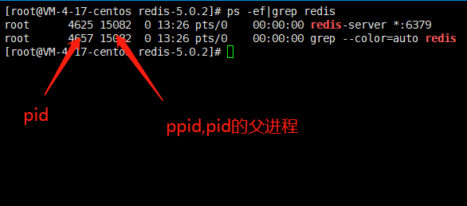

## centos7 redis5.0.2 下载安装

用 wget 直接下载 properties

```properties
wget http://download.redis.io/releases/redis-5.0.2.tar.gz
```

移动到 /opt/mysoftwares 下，用解压命令解压到`/opt`目录下（/opt/mysoftwares 目录就是用来存放各种安装包的，只是为了好整理，解压要解压到`/opt`下）

```properties
tar -zxvf redis-5.0.2.tar.gz -C /opt
```

确保自己的环境有 jcc 编译器，可以编译 c 语言程序，然后执行

```properties
make
```

编译程序。
编译完成后，使用`make install`命令将 redis 的指令建立软链接。这样就可以全局使用 redis 相关命令了。

```xml
make install
```

---

## 启动 redis

```properties
## 前台启动，占用命令行，不推荐
redis-server

## 后台启动 【推荐】
redis-server &

## 未来修改了配置文件，需要指定配置文件后台启动
redis-server redis.conf &
```

redis 默认端口 6379，在 redis.conf 中可以修改

---

## 关闭 redis

1. 直接 kill 进程

```properties
kill -9 pid
```

2. 用 redis-cli【推荐】

```properties
redis-cli shutdown
```

---

## 查看 redis 进程

```properties
ps -ef|grep redis
```



---

## redis 客户端

用来连接 redis 服务，向 redis 服务端发送命令，并且显示 redis 服务处理结果
连接 redis:

```properties
## 默认连接127.0.0.1(本机)的6379端口
redis-cli

## 连接其他端口
redis-cli -p 端口号

## 连接指定ip主机上的指定端口的redis服务，如果有设置密码，带 -a 【密码】
redis-cli -h ip地址 -p 端口号 -a 密码

## eg: 【注意】在云服务器中要外界访问到redis服务，ip需要是是内网ip，
## 用Java连接的时候用公网ip
redis-cli -p 6379 -h 10.0.4.17 -a yourpassword
```

#### 退出客户端

在客户端中执行`exit`或者`quit`命令

---

## redis 基本知识

1. `redis-benchmark`命令 : 测试 redis 并发能力，了解即可。
2. 连接客户端后，`ping`查看 redis 是否正常连接，返回 PONE 即正常。
3. 连接客户端后，`info`查看 redis 服务器的统计信息。
4. redis 的数据库实例：

redis 中的数据库实例只能 redis 创建和维护。
默认情况下，redis 数据库中创建了 16 个数据库。编号 0~15，可以通过配置文件指定创建多少个数据库。
默认连接 0 号数据库。可以使用`select index`切换数据库

5. 查看当前数据库中 key 的数量`dbsize`
6. 查看当前数据库中所有的 key `keys *`
7. 清空数据库实例：`flushdb`
8. 清空所有数据库中的实例：`flushall`
9. 查看 redis 中的配置信息：`config get *`

---

## redis 的 5 种数据结构

1. 字符串 ： （单 key 单 value）
2. list 列表：（单 key 多 value，且有顺序）
3. set 集合：（单 key 多 value，无序）
4. hash 表：（类似对象：student: id : 1000, name : zhangsan , age : 20）
5. zest： （有序集合）

---

## redis 操作命令

#### key 相关

- `keys parttern` 查看数据库中符合通配的数据。
  - -     匹配`多个`字符
  - ? 匹配`1`个字符
  - [ ] 匹配`中括号中的其中一个`字符
- `exists keys` 判断 key 在数据库中是否存在。
  - 返回 1 存在，0 不存在
  - 判断多个，中间空格隔开，返回存在的 key 的个数
- `move key index` 将当前库的某个 key-value 移动到另一个库。
- `ttl（time to live）` 查看指定 key 的剩余生存时间。
  - key 不存在，返回 -2
  - 没设置时间，返回 -1
- `expire key second` 设置 key 的最大超时时间，单位：秒。
- `type key` 查看指定 key 的数据类型。
- `rename key newkey` 重命名 key。
- `del k1 k2 k3 ...` 删除 key，返回实际删除的 key 的数量。

---

#### string 类型相关

- `set key value` 将 string 类型保存到 redis 已存在会覆盖。
- `get key` 获取 value。
- `append key  appendValue` 追加字符串，返回追加之后的字符串长度，key 不存在，则相当于 set。
- `strlen key` 获取字符串长度。
- `incr` 将字符串数值进行+1 运算，不存在则设置 key，初始值为 0，再+1。
- `decr` 将字符串数值进行-1 运算，不存在则设置 key，初始值为 0，再 -1。
- `incrBy key offset` 加 n，不存在则设置 key，初始值为 0，再 +n。
- `decrBy key offset` 减 n，不存在则设置 key，初始值为 0，再 -n。
- `getrange key startIndex endIndex` 获取 startindex 到 endIndex 的子串，下标从 0 开始，源数据不变，支持负数索引。
- `setrange key startIndex string` 覆盖从 startindex 开始的子串，下标从 0 开始，源数据不变，支持负数索引。
- `setex key second value` 设置字符串的同时设置最大生命周期。
- `setnx key value` 不覆盖的设置字符串。
- `mset key1 value1 key2 value2 ...`批量设置 key-value。
- `mget key1 key2 ...`批量获取 key-value。
- `msetnx key1 value1 key2 value2 ...`不覆盖的批量设置，只要有有一个已经存在，则全部放弃设置。

---

#### list 类型相关

- `lpush key value1 value2 value3 ...` 左侧插入
- `rpush key value1 value2 value3 ...` 右侧插入
- `lpushx key value1 value2 value3 ...` 不覆盖左侧插入
- `rpushx key value1 value2 value3 ...` 不覆盖右侧插入
- `lindex key index` 查看第 index 个数据
- `lrange key start end` 切片查看，不改变源数据
- `lpop key` 从列表中移除左侧第一个元素
- `rpop key` 从列表中移除右侧第一个元素
- `llen key` 获取列表长度
- `lrem key count value` 移除列表中指定位置的指定个元素
  - count > 0 移除 count 左边的所有 value
  - count = 0 移除 count 右边的所有 value
  - count = 0 移除所有 value

---

#### set 类型相关

- `sadd key member1 member2 member3 ...` 向 set 集合中添加指定个成员
- `scard key`查看指定 set 集合中的成员个数
- `sdiff key1 key2 ...`比较 set 集合之间的差异，以前面为准
  - eg: sadd set1 1 2 3 4
  -           sadd set2 1 2 3 4 5
  -           sadd set3 5 4 3 2 1
  - 如果执行`sdiff set1 set2`，则返回空集合
  - 如果执行`sdiff set2 set1`，则返回 `"5"`
  - 如果执行`sdiff set2 set3`，则返回空集合
- `sinter key1 key2 key3 ...` 返回这些集合的交集
- `sinterstore storeName key1 key2` 返回集合的交集并且放到 storeName 里
- `sismember key member` 判断这个 member 是否在 key 这个 set 集合中
- `smembers key` 返回当前集合中的所有成员
- `smove source distination member` 将 source 这个 set 集合中的 mebmber 这个成员移动到 distination 这个 set 集合中
- `spop key count` 移除 set 集合中随机 count 个成员，count 默认为 1
- `srandmember key count` 随机返回 count 个集合中的成员，不影响原数据
- `srem key member1 member2 member3 ...` 删除指定成员
- `sunion key1 key2 key3 ...` 返回集合的并集

---

#### hash 表类型相关

- `hset key filed value` 将 key 的 filed 设置为 value
- `hget key filed` 获取指定 key 的指定 filed 的值
- `hgetall key` 获取 key 的所有 filed 和 value 值
- `hsetnx key filed value` 不覆盖的设置 filed 的 value
- `hmset key filed1 value2 filed2 value2` 存在 filed 就覆盖，不存在就创建
- `hlen key` 获取指定 key 有多少个键值对
- `hexists key filed` 指定 key 的指定 filed 是否存在
- `hkeys key` 返回 key 的所有 filed
- `hvals key` 返回 key 的所有 value
- `hincrby key filed count` 将数字类型的 value 加 count
- `hdel key filed1 value1 filed2 value2 ...` 删除指定 key 的多个指定 filed 的值，不存在就忽略

---

#### zset 类型相关

- `zadd key scope value scope value` 给指定的 key 中添加分数为 scope 的 value，按照 scope 排序
- `zrange key startIndex endIndex` 获取从 startIndex 到 endIndex 的值
- `zcard key` 查看指定 zset 中的元素个数
- `zrank key member` 查看指定成员的下标
- `zscore key member` 查看指定成员的 scope 分数
- `zrangebyscore key min max` 获取 zset 中指定分数区间的值
- `zrevrange key min max` 倒序输出指定范围内的值
- `zrevrangebyscope key max min` 倒序以 scope 输出指定范围内的值
- `zrem key member1 member2 ...` 删除一个或多个 zset 中的成员
- `zremrangebyscore key min max` 删除指定区间内的值，以分数排序
- `zremrangebyrank key min max` 删除指定区间内的值，以下标排序
- `zunionstore destination key1 key2 ...` 求这些 key 的并集并放到 destination 这个 zset 中
- `zinterstore destination key1 key2 ...` 求这些 key 的交集并放到 destination 这个 zset 中

---

## redis 配置文件

- redis 安装好后，在 radis 的安装根目录下有默认为 redis.conf 的配置文件。
- 更改配置文件后，再次启动 redis 必须指定配置文件

#### redis 关于网络的设置

- `port` 指定 redis 服务所使用的端口，默认使用 6379
- `bind` 配置客户端连接 redis 服务时，所能使用的 ip 地址，默认可以使用 redis 服务所在主机上任何一个 ip，一般在开发中，都会配置一个真实 ip。

修改了 ip 和端口后，开启和关闭时都需要指定 ip 和端口

```java
// 开启
redis-server -h 192.168.1.1 -p 6380

// 关闭
redis-cli -h 192.168.1.1 -p 6380 shutdown
```

- `tcp-keepalive` 连接保活策略。

---

#### 常规配置

- `loglevel`配置日志级别，符合 log4j 日志级别，开发一般都是 debug 级别
- `logfile` 指定日志文件
- `databases` 创建数据库实例的个数

---

#### 安全配置【不常用】

- `protected-mode` 安全模式开关
- `requirepass` 设置密码，必须在 protected-mode 为 yes 时才会生效，一般不用
  - 开启后，连接需要加 `-a password`

---

## redis 持久化

redis 是内存数据库，在服务器宕机后，所有的数据都会丢失。所以 redis 提供持久化操作，在适当的时机，采用适当的策略，将数据写入磁盘，下次再加载到内存中。

#### RDB 策略【redis 默认开启】

在指定时间间隔内，redis 服务在指定时间内，执行指定次数的写操作，会触发一次持久化操作，将数据持久化到磁盘上，默认：1 分钟改变一万次，或者 5 分钟改变十次，或者 15 分钟内改变了一次，会触发持久化操作。

- 配置文件中`save <second> <change>` 是修改策略的
- 配置文件中`dbfilename location` 持久化操作存储在那个文件下，默认为 dump.rdb

---

#### AOF 策略

采用操作日志的方式记录每一次写操作，每次启动 redis 时，将文件中的操作执行，达到恢复数据的目的。效率相较于 RDB 较低，redis 默认不开启

- `appendonly` 开启 AOF 策略，yes / no
- `appendfilename` AOF 保存文件名
- `appendfsync` AOF 异步持久化策略
  - always:同步持久化，每次发生数据变化会立刻写入到蓝盘中。性能较差但数据完整性比较好(慢，安全)
  - everysec:出厂默认推荐，每秒异步记录一次（默认值）
  - no:不即时同步，由操作系统决定何时同步。
- `no-appendfsync-on-rewrite` 重写时是否可以运用 appendsync,默认 no,可以保证数据的安全性。
- `auto-aof-rewrite-percentage` 设置重写的基准百分比
- `auto-aof-rewrite-min-size` 设置重写的基准值

---

## redis 事务

redis 事务不能保证全部原子性。当事务在压入队列中就发生了错误，此时执行事务时事务队列中所有命令都不会执行，但在队列执行过程中法伤错误，则只会影响那一条命令的结果，不会取消全部命令的执行，这样就无法办证事务的原子性。

- `multi` 用来标记一个事务的开始，执行命令后，将接下来执行的所有命令放到事务队列中，等待执行。
- `exec` 用来执行事务队列中所有的命令。
- `discard` 清除所有已经压入队列中的事务，并且结束当前事务。
- `watch key1 key2 ...` 监控这些 key，当事务在执行过程中，这些 key 发生了变化，则放弃执行事务。
- `unwatch` 放弃监控和所有的 key

---

## redis 消息发布与订阅【了解即可】

redis 客户端订阅频道，消息发布者将消息发到指定频道上，所有订阅了该频道的客户端都可以接收到消息，实现客户端之间的通信。

- `subscribe channel1 clannel2 ...` 订阅一个或多个频道
- `publish channel` 向指定频道发布消息
- `psubscribe channel1 clannel2 ...` 订阅一个或多个频道，支持通配符

---

## redis 主从复制

主少从多，主写从读，读写分离，主写同步复制从。

模拟多台主机的多个 redis 服务：

1. 复制三份 redis.conf 分别叫：redis6379.conf redis6380.conf redis6381.conf
2. 分别修改对应配置文件的 port，pidfile，logfile，dbfilename 不同
3. 分别用三个 redis 配置文件在不同端口启动三个 redis 服务
