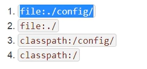
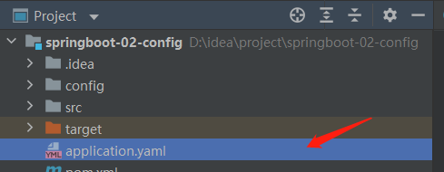
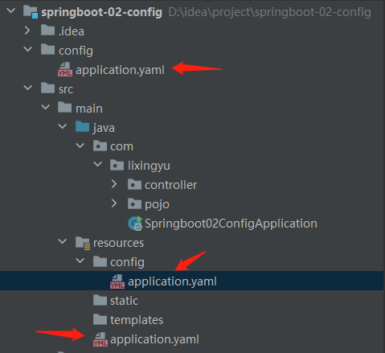
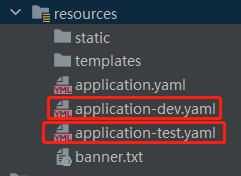
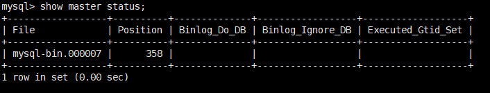
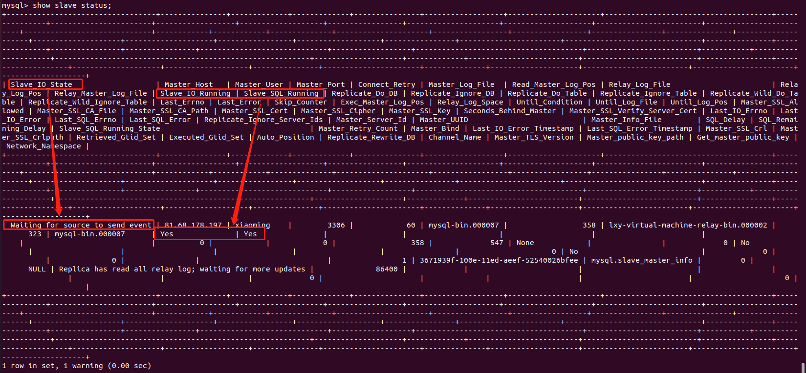
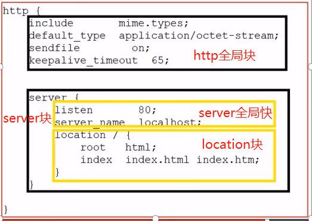

在 idea 中，可以使用 spring intializr 快速构建 springBoot 项目。

## springboot 配置文件

pom 文件

```xml
<?xml version="1.0" encoding="UTF-8"?>
<project xmlns="http://maven.apache.org/POM/4.0.0" xmlns:xsi="http://www.w3.org/2001/XMLSchema-instance"
         xsi:schemaLocation="http://maven.apache.org/POM/4.0.0 https://maven.apache.org/xsd/maven-4.0.0.xsd">
    <modelVersion>4.0.0</modelVersion>
    <!--springboot默认生成的父工程-->
    <parent>
        <groupId>org.springframework.boot</groupId>
        <artifactId>spring-boot-starter-parent</artifactId>
        <version>2.7.1</version>
        <relativePath/> <!-- lookup parent from repository -->
    </parent>
    <groupId>com.lixingyu</groupId>
    <artifactId>HelloSpringBoot</artifactId>
    <version>0.0.1-SNAPSHOT</version>
    <name>HelloSpringBoot</name>
    <description>HelloSpringBoot</description>
    <properties>
        <java.version>1.8</java.version>
    </properties>
    <!-- web依赖，tomcat,dispatcherServlet, ..xml ......各种启动器 -->
    <dependencies>
        <dependency>
            <groupId>org.springframework.boot</groupId>
            <artifactId>spring-boot-starter-web</artifactId>
        </dependency>

        <dependency>
            <groupId>org.springframework.boot</groupId>
            <artifactId>spring-boot-starter-test</artifactId>
            <scope>test</scope>
        </dependency>
    </dependencies>

    <!-- 打jar包工具 -->
    <build>
        <plugins>
            <plugin>
                <groupId>org.springframework.boot</groupId>
                <artifactId>spring-boot-maven-plugin</artifactId>
                <version>2.7.1</version>
            </plugin>
        </plugins>
    </build>

</project>
```

- 启动器

```xml
<dependency>
	<groupId>org.springframework.boot</groupId>
	<artifactId>spring-boot-starter-web</artifactId>
</dependency>
```

springboot 中的各种启动器，都是以 spring-boot-starter 开头，用来启动各类服务。

---

## yaml 格式

springboot 推荐使用.yaml 格式代替.properties 文件

```yaml
server:
  port: 8081
user:
  name: lixingyu
  age: 20
  email: 123
```

yaml 以空格控制，以上配置相当于：

```properties
server.port=8081
user.name=lixingyu
user.age=20
user.email=123
```

---

## jsr303 校验

注入信息时可以为数据加校验
例：

```java
package com.lixingyu.pojo;

import org.springframework.boot.context.properties.ConfigurationProperties;
import org.springframework.stereotype.Component;
import org.springframework.validation.annotation.Validated;

import javax.validation.constraints.Email;

@Component		// 注册到spring容器中
@ConfigurationProperties(prefix = "user")		// 在springboot的配置文件的user绑定user到实体类上
@Validated			// 开启数据校验
public class User {

    private String name;
    private int age;
    @Email(message = "邮箱有误")			// 校验这个字段为邮箱
    private String email;

    public User() {
    }

    public User(String name, int age, String email) {
        this.name = name;
        this.age = age;
        this.email = email;
    }

    public String getName() {
        return name;
    }

    public void setName(String name) {
        this.name = name;
    }

    public int getAge() {
        return age;
    }

    public void setAge(int age) {
        this.age = age;
    }

    public String getEmail() {
        return email;
    }

    public void setEmail(String email) {
        this.email = email;
    }

    @Override
    public String toString() {
        return "User{" +
                "name='" + name + '\'' +
                ", age=" + age +
                ", email='" + email + '\'' +
                '}';
    }
}

```

如果在 user 中绑定的数据不是邮箱类型，就会报错，

```java
    Property: user.email
    Value: 123
    Origin: class path resource [application.yaml] - 6:10
    Reason: 邮箱有误

```

---

## 多文件配置

在哪些位置可以写.yaml / properties 配置文件：


- file:指项目的根目录
- classpath:指文件的 resourse 目录
- yaml 的文件名必须叫 application.yaml




#### 4 个位置配置文件的优先级

1. file: ./config/application.yaml
2. file: ./application.yaml
3. classpath: ./config/application.yaml
4. classpath: ./application.yaml

## springboot 多环境配置：

#### yaml 配置 springboot 多环境配置

如：测试环境和生产环境切换：

只需要在默认的 application.yaml 文件中指定：

```yaml
spring:
  profiles:
    active: dev
```

这样就使用了 application-dev.yaml 这个配置文件。

在一个 yaml 配置文件中，使用`---`分割多套环境

```yaml
server:
  port: 8081
spring:
  profiles:
    active: dev

---
server:
  port: 8082
spring:
  profiles: dev
---
server:
  port: 8083
spring:
  profiles: test
```

## springboot 中使用 put/delete 请求

在 springmvc 中，要使用 put/delete,要在 web.xml 中添加一个 hiddenmethodfilter 过滤器，在 springboot 中，只需要在配置文件中加入

```properties
spring.mvc.hiddenmethod.filter.enabled=true
```

即可启用过滤器。在 controller 中添加 PutMapping 注解：

```java
@PutMapping("/testput")
@ResponseBody
public String testPut() {
	return "put";
}
```

在表单中添加隐藏域，name="\_method" value="put/delete" 即可

```html
<form action="testput" method="post">
  <input type="hidden" name="_method" value="put" />
  <input type="text" name="username" />
  <input type="submit" value="提交" />
</form>
```

---

## 任务

#### 异步任务

开启异步任务，只需要在 springboot 主启动类上添加@EnableAsync 注解

```java
@EnableAsync
@SpringBootApplication
public class Springboot06MailApplication {

    public static void main(String[] args) {
        SpringApplication.run(Springboot06MailApplication.class, args);
    }

}
```

在想要异步执行的方法上添加@Async 注解，这个方法就会被异步执行，不会影响后续程序的执行

---

#### 邮件任务

邮件发送方开启 smtp 协议。
springboot 中只需要导入一个邮件的启动器即可

```xml
<dependency>
	<groupId>org.springframework.boot</groupId>
	<artifactId>spring-boot-starter-mail</artifactId>
</dependency>
```

在配置文件中写入你的邮箱的账号，授权码，发送服务器

```properties
spring.mail.username=2870461090@qq.com
spring.mail.password=wxtzqhkdbyiadfgd
spring.mail.host=smtp.qq.com
## qq邮箱需要额外添加一个验证
spring.mail.properties.mail.smtp.ssl.enable=true
```

然后就可以测试了

```java
@Autowired(required = false)
JavaMailSenderImpl javaMailSender;

@Test
void contextLoads() {
	SimpleMailMessage simpleMailMessage = new SimpleMailMessage();

	simpleMailMessage.setSubject("title");
	simpleMailMessage.setText("一封测试邮件,如果你觉得很奇怪,那就是我发错人了,抱歉");
	simpleMailMessage.setTo("a18947883779@163.com");
	simpleMailMessage.setFrom("2870461090@qq.com");

	javaMailSender.send(simpleMailMessage);
}

```

使用 MailSender.createMimeMessage 可以创建复杂邮件，包括发送附件等

```java
@Autowired(required = false)
JavaMailSenderImpl MailSender;

@Test
void contextLoads() throws MessagingException {

	MimeMessage mimeMessage = MailSender.createMimeMessage();

	MimeMessageHelper helper = new MimeMessageHelper(mimeMessage,true);

	// 标题
	helper.setSubject("lxy");
	正文，第二个参数true代表可以解析html
		helper.setText("<a href='http://localhost:8080/hello'>hello</a>",true);
	// 一张图片附件
	helper.addAttachment("1.jpg",new File("C:\\Users\\lxy\\OneDrive\\桌面\\myImages\\1.jpg"));
	helper.setTo("2870461090@qq.com");
	helper.setFrom("2870461090@qq.com");

	MailSender.send(mimeMessage);
}

```

---

#### 定时任务

和异步任务类似，在 spring boot 中要添加定时任务，要在主启动类上添加注解

```java
@EnableScheduling // 开启定时任务注解
```

在要定时执行的方法上加注解，就可以定时执行，注解中传入一个 cron 表达式

```java
//                秒 分 时 日 月 周几
@Scheduled(cron = "* 2 23 * * ?")
public void hello() {
	System.out.println("ScheduledService执行了");
}
```

**cron 表达式例子：**
（1）0 0 2 1 _ ? _ 表示在每月的 1 日的凌晨 2 点调整任务
（2）0 15 10 ? _ MON-FRI 表示周一到周五每天上午 10:15 执行作业
（3）0 15 10 ? 6L 2002-2006 表示 2002-2006 年的每个月的最后一个星期五上午 10:15 执行作
（4）0 0 10,14,16 _ _ ? 每天上午 10 点，下午 2 点，4 点
（5）0 0/30 9-17 _ _ ? 朝九晚五工作时间内每半小时
（6）0 0 12 ? _ WED 表示每个星期三中午 12 点
（7）0 0 12 \* _ ? 每天中午 12 点触发
（8）0 15 10 ? _ _ 每天上午 10:15 触发
（9）0 15 10 _ _ ? 每天上午 10:15 触发
（10）0 15 10 _ _ ? _ 每天上午 10:15 触发
（11）0 15 10 \* _ ? 2005 2005 年的每天上午 10:15 触发
（12）0 _ 14 \* _ ? 在每天下午 2 点到下午 2:59 期间的每 1 分钟触发
（13）0 0/5 14 _ _ ? 在每天下午 2 点到下午 2:55 期间的每 5 分钟触发
（14）0 0/5 14,18 _ _ ? 在每天下午 2 点到 2:55 期间和下午 6 点到 6:55 期间的每 5 分钟触发
（15）0 0-5 14 _ _ ? 在每天下午 2 点到下午 2:05 期间的每 1 分钟触发
（16）0 10,44 14 ? 3 WED 每年三月的星期三的下午 2:10 和 2:44 触发
（17）0 15 10 ? _ MON-FRI 周一至周五的上午 10:15 触发
（18）0 15 10 15 _ ? 每月 15 日上午 10:15 触发
（19）0 15 10 L _ ? 每月最后一日的上午 10:15 触发
（20）0 15 10 ? _ 6L 每月的最后一个星期五上午 10:15 触发
（21）0 15 10 ? _ 6L 2002-2005 2002 年至 2005 年的每月的最后一个星期五上午 10:15 触发
（22）0 15 10 ? _ 6##3 每月的第三个星期五上午 10:15 触发
（23）0 0 3 1 _ ? 每月月初 3 点

---

## 集成 redis

#### jedis

依赖

```xml
<dependency>
  <groupId>redis.clients</groupId>
  <artifactId>jedis</artifactId>
</dependency>
```

测试

```java
public class MyTest {
    @Test
    public void test() {
        Jedis jedis = new Jedis("81.68.178.197",6379);
        jedis.auth("20010907lxy");			// 有密码的话需要加auth
        jedis.set("username","lixingyu");
        String s = jedis.get("username");
        System.out.println(s);		// lixingyu
    }
}
```

---

#### spring-boot-starter-data-redis

在 springboot 整合 redis 时，只要加入对应的依赖即可（或者在创建项目时候直接勾选 redis）
依赖

```xml
<dependency>
  <groupId>org.springframework.boot</groupId>
  <artifactId>spring-boot-starter-data-redis</artifactId>
</dependency>
```

在配置文件中加入自己的 redis 连接信息

```yaml
spring:
  redis:
    host: 81.68.178.197
    password: 123456
    port: 6379
    database: 0 ## 使用0号数据库
    jedis:
      pool:
        max-active: 8 ## 最大连接数
        max-wait: 1ms ## 连接池最大阻塞时间
        max-idle: 4 ## 连接池最大空闲连接
        min-idle: 0 ## 连接池最小空闲连接
```

如果你的 redis 跑在云服务器上，在 redis 的配置文件中修改 bind 为自己**公网 ip 对应的内网地址**，直接写公网 ip 会连接失败，在 springboot 配置时，写的就是你服务器的公网 ip 了。
测试：

```java
@SpringBootTest
class Springboot07RedisApplicationTests {

    @Resource
    RedisTemplate redisTemplate;

    @Test
    void contextLoads() {

		// 序列化
        RedisSerializer redisSerializer = new StringRedisSerializer();
        redisTemplate.setKeySerializer(redisSerializer);
        redisTemplate.setStringSerializer(redisSerializer);
        redisTemplate.setValueSerializer(redisSerializer);
		// 设置key-value
        redisTemplate.opsForValue().set("pattern","hello");

    }

}
```

**在设置 key-value 时，会产生序列化问题**
会导致你的 key 前面加上一堆的 "\xac\xed\x00\x05t\x00" 字符，在设置时需要先序列化，再设置值

设置序列化的工具类

```java
package com.lixingyu.reggie.config;

import org.springframework.cache.annotation.CachingConfigurerSupport;
import org.springframework.context.annotation.Bean;
import org.springframework.context.annotation.Configuration;
import org.springframework.data.redis.connection.RedisConnectionFactory;
import org.springframework.data.redis.core.RedisTemplate;
import org.springframework.data.redis.serializer.StringRedisSerializer;

@Configuration
public class RedisConfig extends CachingConfigurerSupport {

    @Bean
    public RedisTemplate<Object,Object> redisTemplate(RedisConnectionFactory connectionFactory) {
        RedisTemplate<Object,Object> redisTemplate = new RedisTemplate<>();

		// 血泪教训 : 序列化时候最好只序列化key,其他的序列化了可能java无法映射成实体类
        StringRedisSerializer stringRedisSerializer = new StringRedisSerializer();

        redisTemplate.setKeySerializer(stringRedisSerializer);
        // redisTemplate.setHashKeySerializer(stringRedisSerializer);
        // redisTemplate.setValueSerializer(stringRedisSerializer);
        // redisTemplate.setStringSerializer(stringRedisSerializer);

        redisTemplate.setConnectionFactory(connectionFactory);

        return redisTemplate;
    }

}
```

---

#### springCache

简化缓存操作
可以切换缓存实现的不同 cacheManager
常用注解

```java
@EnableCaching	// 启动类 开启缓存
@Cacheable		// 查看缓存中是否有缓存
@CachePut		// 将方法返回值放入缓存
@CacheEvict		// 将一条或多条缓存删除
```

导包：
只需要导入对应缓存实现技术的 starter 即可

注意：
@Cacheable 中的 condation 不能使用 result，unless 可以

---

## linux 自动化部署脚本

```shell
##!/bin/sh
echo =================================
echo  自动化部署脚本启动
echo =================================

echo 停止原来运行中的工程
APP_NAME=reggie

tpid=`ps -ef|grep $APP_NAME|grep -v grep|grep -v kill|awk '{print $2}'`
if [ ${tpid} ]; then
    echo 'Stop Process...'
    kill -15 $tpid
fi
sleep 2
tpid=`ps -ef|grep $APP_NAME|grep -v grep|grep -v kill|awk '{print $2}'`
if [ ${tpid} ]; then
    echo 'Kill Process!'
    kill -9 $tpid
else
    echo 'Stop Success!'
fi

echo 准备从Git仓库拉取最新代码
cd /usr/local/reggie

echo 开始从Git仓库拉取最新代码
git pull
echo 代码拉取完成

echo 开始打包
output=`mvn clean package -Dmaven.test.skip=true`

cd target

echo 启动项目
nohup java -jar reggie_take_out-1.0-SNAPSHOT.jar &> helloworld.log &
echo 项目启动完成

```

- 部署项目只要自己修改项目名称就好
- 需要系统中安装 git
- 需要有 maven
- 注意文件权限

## mysql 主从复制

可以将 mysql 数据库的读写分离，达到减轻数据库压力的作用。
在两个主机上分别启动两个 mysql 服务，一个为 master,主要用于写，slave,从库可以拥有多个。

#### 主库 master

- 主服务器在 my.cnf 中配置 server-id 和二进制日志

```shell
##主服务器唯一Id[必填]
server-id=1
##启用二进制日志[必填]
log-bin=自己mysql的路径/mysqlbin
```

- 在主服务器上创建并授权 slave

```sql
-- 创建并授权
GRANT REPLICATION SLAVE ON *.* TO 'xiaoming' @ '%' IDENTIFIED BY '123456';

-- 刷新权限
flush privileges;

-- 查看master的状态
show master status;
```

执行 show master status;后，可以看到

前两项为当前二进制日志文件和位置，在从库中需要配置，**此时不要操作主库**，操作主库这两个值可能变化

#### 从库 slave

从库中也必须在 my.cnf 中配置 server-id，必须唯一

然后连接从库，在从库中执行

```sql
change master to master_host='81.68.178.197',
								 master_user='xiaoming',
								 master_password='20010907lxy',
								 master_log_file='mysql-bin.000007',
								 master_log_pos=358;
```

- master_host : 主服务器 ip
- master_user : 主服务器创建的用户
- master_password：主服务器创建用户的密码
- master_log_file ： 主库执行 show master status; 时的第一个 File 项
- master_log_pos ： 主库执行 show master status; 时的第二个 Position 项

如果出现报错说线程被占用，执行 **stop slave;** 即可

执行 show slave status; 看到

Slave_IO_State 为 Waiting for source to send event
Slave_IO_Running 和 Slave_SQL_Running 都为 yes 即为成功
此时在主库中执行 sql,从库中会自动更新。

## nginx

下载地址：[https://nginx.org/en/download.html](https://nginx.org/en/download.html)

- 启动：执行 nginx 安装目录下的 sbin/nginx 二进制文件 ./nginx
- 停止：./nginx -s stop
- 查看进程：ps -ef | grep nginx
- 重新加载配置文件：==nginx -s relocd

#### 配置文件

（ /conf/nginx.conf ）分为三大块：

- 全局块
- events 块
- http 块【主要】
  - http 全局块
  - server 块
    - server 全局块
    - location 块

http 块 套娃：



- 一个 http 块可以拥有多个 server 块
- 一个 server 块可以拥有多个 location 块
