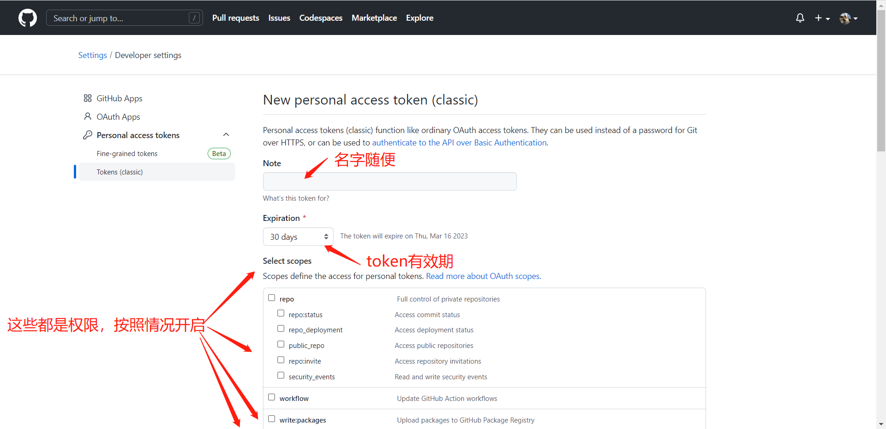
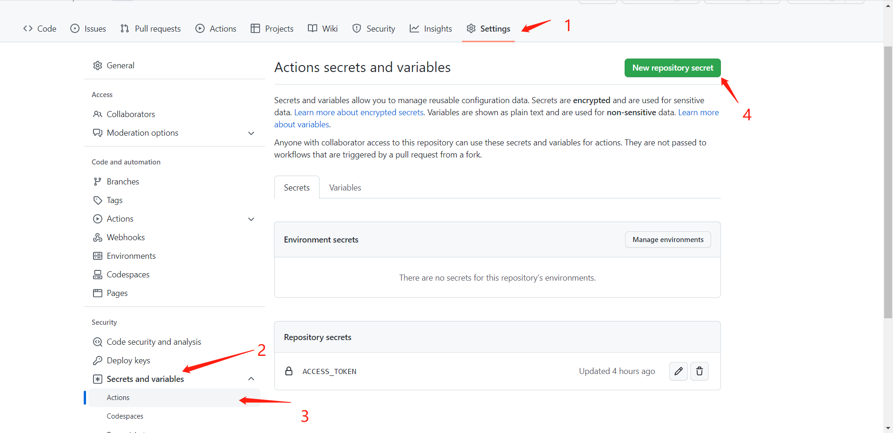
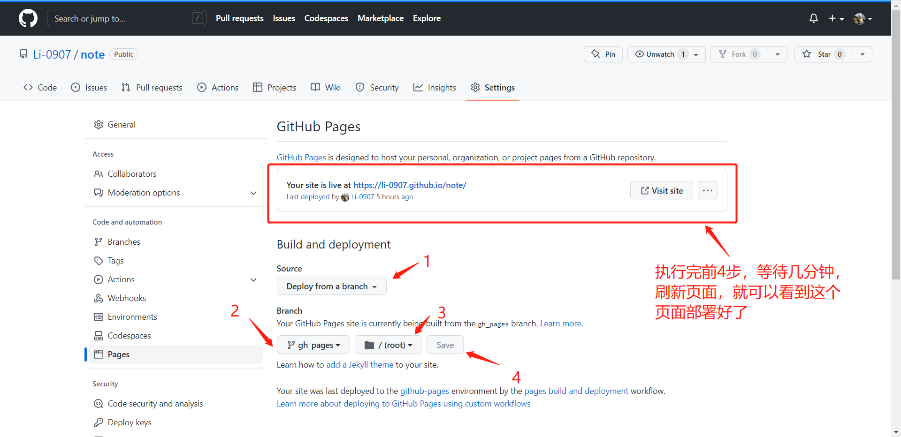

[vuePress 官方文档地址 👈](https://vuepress.vuejs.org/zh/)

因为想使用 vue3 + vite 搭建，所以这里使用 2.x 版本的 vuePress

## 创建模板

官方文档的所有操作都是在 linux 系统下进行的，有些指令并不相同

1.  首先创建一个文件夹，名字就是项目名字

2.  使用 yarn 命令初始化一个 package.json

    ```bash
    yarn init # npm使用 npm init
    ```

3.  安装 vuePress 依赖

    ```bash
    yarn add -D vuepress@next
    ```

4.  在 package.json 中的 scripts 节点下添加指令：

    ```json
    {
      "scripts": {
        "docs:dev": "vuepress dev docs", // 本地运行
        "docs:build": "vuepress build docs" // build
      }
    }
    ```

5.  使用 **git init** 初始化 git,将 node_models, .temp, .cache 文件加入 .ignore 问价中

    ```.ignore
    node_modules
    .temp
    .cache
    ```

6.  基本的项目结构是这样的：

    ```text
    ├─ docs
    │  ├─ .vuepress
    │  │  └─ config.js / config.ts
    │  └─ README.md
    ├─ .gitignore
    └─ package.json
    ```

    其中如果你想使用 ts ,可以创建 config.ts,并导入 **defineUserConfig** ，可以有 ts 的类型检查

7.  我这里使用了 ts, config.ts 基本结构是这样的

    ```typescript
    import { defineUserConfig } from 'vuepress'

    export default defineUserConfig({
      lang: 'zh-CN',
      title: 'MY NOTES',
      description: '我的个人博客'
    })
    ```

我们在 docs 下创建一个文件夹，例如 front/java 来存放我们的 markdown 文件，里面的默认路由是 README.md

不同的文件夹就对应不同的路由地址，比如：

docs/web --> http://localhost:8080/web/

docs/java --> http://localhost:8080/java

这样一个基本的样子就有了

## 起始页

那么像官网那样的起始页如何设置呢？

我们项目的根目录/docs 同级下有一个 README.md,可以将这个文件设置为项目的首页

```markdown
---
home: true
heroImage: /test.png
heroText: Welcome to my notes
tagline: 🛻🛻🛻🛻
actions:
  - text: ↙ 前端相关
    link: /web/vite + vue + electron 简单环境搭建.md
    type: secondary
  - text: java相关 ↘
    link: /java/端口占用解决办法.md
    type: secondary
features:
  - title: 前端相关
    details: 应该多数为vue相关的知识，记录bug，记录有趣的东西，但是目前丢失了大部分笔记，只能慢慢来
  - title: java相关
    details: 学习spring等东西记录的一些概念，以及一些容易忘的解决问题的方法
footer: 积跬步 至千里
---
```

home: 是否开启首页

homeImage: 首页图片

heroText: 分割线上方文字

tagline: 分割线

actions:

-text: 开始按钮文字，actions 可以有多个

-link: 链接的文章

-type: 可选值有 primary / secondary 即为实心和空心的按钮

features:

-title: 底部 features 的标题，features 可以有多个

-details: features 具体描述

更多的首页配置，请参考： [官方文档首页配置 👈](https://v2.vuepress.vuejs.org/zh/reference/default-theme/frontmatter.html#%E9%A6%96%E9%A1%B5)

路由，navBar 等等配置都可以在官方文档中找到，这里不过多赘述

## 部署到 github pages

首先在 github 创建一个仓库，将本地的代码上传到这个仓库，注意 github 分支默认名字叫做 main，gitee 叫做 master,所以首次 push 命令应该是：

```bash
git push origin main
```

然后我们要使用 github actions 实现每次 push 操作都自动部署到 github pages 上

### 配置 personal access token

点击右上角头像，点击 settings --> developer settings --> personal access token --> tokens (classify) 中添加一个新的 token，



最后点击 Generate token 生成 token ,将 token 复制下来，后面要用（token 跟密码一样重要，请不要泄露）

### 将 token 设置到项目中的 secrets 中

我们打开 github 项目，点击项目的 settings --> Secrets and variables --> actions --> New repository secret



nane 填 ACCESS_TOKEN， value 添你刚刚复制的 access token

### 部署前项目的修改

如果你想将页面配置到 https://(你的 github 名称).github.io/(你指定的路径)/ 下，需要在 config.ts / config.js 中加入 base 属性，指定 base 属性，如果直接部署到 https://(你的 github 名称).github.io/,则不用配置，因为默认就是 / ， 记得将修改 push 到仓库

```typescript
import { defineUserConfig } from 'vuepress'

export default defineUserConfig({
  lang: 'zh-CN',
  title: 'MY NOTES',
  base: '/你指定的路径/',
  description: '我的个人博客'
})
```

### 配置 GitHub actions

接下来到仓库中点击 actions 新建一个 workflow,填写以下 yml 格式配置：

```yaml
name: Build and Deploy
on: [push]
jobs:
  build-and-deploy:
    runs-on: ubuntu-latest
    steps:
      - name: Checkout
        uses: actions/checkout@master

      - name: vuepress-deploy
        uses: jenkey2011/vuepress-deploy@master
        env:
          ACCESS_TOKEN: ${{ secrets.ACCESS_TOKEN }}
          TARGET_REPO: 你的github用户名/你的仓库名
          TARGET_BRANCH: gh_pages
          BUILD_SCRIPT: git config --global --add safe.directory "*" && yarn && yarn docs:build
          BUILD_DIR: docs/.vuepress/dist
```

他的原理就是将你的代码拉取到一个 ubuntu 系统上，选用 node 环境，新建一个 gh_pages 分支，将 build 好的你的项目推送到你的分支上，接下来这个分支就可以当作你 githubpages 的首页进行展示了。

### 配置 GitHub pages

接下来点击你项目的 settings --> pages 按照图中的配置，等部署好后，点击 Visit site 就可以看到你的博客了



恭喜你，完成了博客在 GitHub pages 的部署
